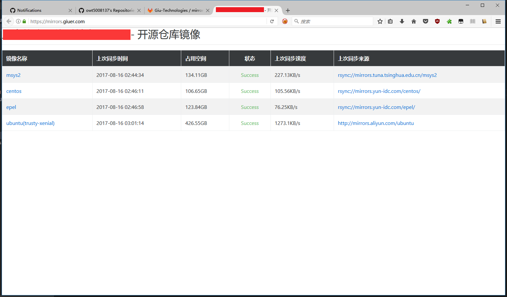

# 开源镜像同步工具

写得比较暴力，目前支持两种方式，一种是rsync，另一种是[apt-mirror][1]。

[tools/repos.txt](tools/repos.txt) 是软件源的配置，[tools/sync.status.txt](tools/sync.status.txt)是同步的状态（用于显示在页面上的）。

[tools/rsync_repos.sh](tools/rsync_repos.sh) 是需要定期执行的启动同步的脚本。

[tools/ubuntu-mirror.list](tools/ubuntu-mirror.list) 是[apt-mirror][1]的配置。

需要保证[tools](tools)目录可写，因为会写日志。

需要保证[etc](etc)目录放了一些改源的配置示例。

其他的按nodejs标准的方式来好了。需要先build一下，来通过typescript生成目标javascript脚本和模板内容。

# 截图示例

[1]: https://github.com/apt-mirror/apt-mirror.git